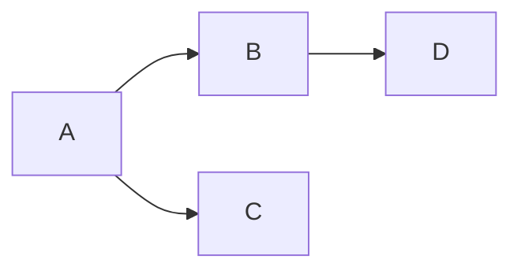

# Level 1 heading

## Level 2 heading

### Level 3 heading

A bulleted checklist:
- [ ] Bullet 1
- [x] Bullet 2

Embed http links in text: [this is a link](https://theresanaiforthat.com/)

Host my own image in google photo: 

### Math

This sentence uses `$` delimiters to show math inline:  $\sqrt{3x-1}+(1+x)^2$

Use Mermaid to drawn simple math and computer science diagrams:
